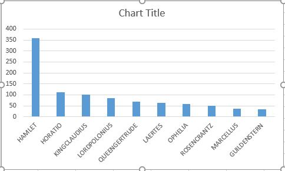

# bigdata-project-spark-option

This project lets us find word count in a data file using spark.

### Getting the data for our project:

I am using the data available at [http://shakespeare.mit.edu/hamlet/full.html](http://shakespeare.mit.edu/hamlet/full.html) for my project. 

Getting the HTML to a text file using curl commands.

open Git bash on you computer and run the command ```curl "URL for Website" -O "file name to be saved"```

An example of the command I used is ```curl "http://shakespeare.mit.edu/hamlet/full.html" -O
"hamlet.txt"```

Clean up most of the HTML tags using the sed command below

```sed -E 's/<[^>]*>/''/g' hamlet.txt > hamlet_cleaned.txt```

Similarly, remove unwanted data you don't want to count. Now we have our data file ready for spark.

Now for this project, we are not considering the top 35 common words in English as per Wikipedia [https://en.wikipedia.org/wiki/Most_common_words_in_English](https://en.wikipedia.org/wiki/Most_common_words_in_English)

to remove these words use the sed command 

```sed -E 's/\b(the|The|be|Be|to|To|of|Of|And|and|a|A|in|In|that|That|have|Have|i|I|it|It|for|For|not|Not|on|On|with|With|he|He|as|As|you|You|do|Do|at|At|this|This|his|His|by|By|from|From|they|They|we|We|say|Say|her|Her|she|She|or|Or|but|But|will|Will|So|so|my|is|your|me|him|are|what|.|O)\b/''/g' hamlet.txt > hamlet_cleaned.txt```

You can add any other words you would like to ignore

---

### Processing the Data using spark.

If you would like to set up Spark on your computer from scratch the repo [https://github.com/denisecase/setup-spark](https://github.com/denisecase/setup-spark) is a good start.

Open PowerShell and run ```spark-shell``` to bring up spark with scala.

Create a Resilient Distributed Dataset (RDD) from the text file which we have created. Use the command to do so

```val rddData = sc.textFile("hamlet_cleaned.txt")```

This command creates an RDD named rddData. Now we have to split the words in ```rddData``` to work on their counts. The below command does so.

```val rddDataSplit = rddData.flatMap(line => line.split(" "));```

Here we are splitting the ```rddData``` based on spaces and saving it into a new dataset ```rddDataSplit```

Since RDD's are [immutable](https://www.google.com/search?q=immutable&rlz=1C1GCEB_enUS863US863&oq=imm&aqs=chrome.0.69i59j69i57j0i67l2j0i433j0i67i433j69i60l2.863j0j4&sourceid=chrome&ie=UTF-8), we cannot work on the same RDD for modifications hence we create a new one.

The RDD has a method called ```collect()``` to get all the elements of a dataset.

```rddDataSplit.collect()```

The above command gives us an array of elements as below:

``` Array("", "", Hamlet, Entire, Play, "", "", "", Tragedy, "", Hamlet, Prince, "", Denmark, "", "", "", "", "", "", "", Shakespeare, homepage, "", "", "", "", |, Hamlet, "", "", "", "", |, Entire, play, "", "", ACT, SCENE, ., Elsinore., "", platform, before, "", castle., "", FRANCISCO, "", "", post., Enter, "", "", BERNARDO, "", "", BERNARDO, "", Who's, there?, "", "", FRANCISCO, "", Nay, answer, "", stand```

But there is no count as such. So we have to create key-value pairs of words, let's begin by assigning all words, a count of one and the below command does the same operation.

```val rddMapData = rddDataSplit.map(word =>(word,1));```

Now if call the ```collect()``` method we get the array in key-value pairs as below

```Array(("",1), ("",1), (Hamlet,1), (Entire,1), (Play,1), ("",1), ("",1), ("",1), (Tragedy,1), ("",1), (Hamlet,1), (Prince,1), ("",1), (Denmark,1), ("",1), ("",1), ("",1), ("",1), ("",1), ("",1), ("",1), (Shakespeare,1), (homepage,1), ("",1), ("",1), ("",1), ("",1), (|,1), (Hamlet,1), ("",1), ("",1), ("",1), ("",1), (|,1), (Entire,1), (play,1), ("",1), ("",1), (ACT,1), (SCENE,1), (.,1), (Elsinore.,1), ("",1), (platform,1), (before,1), ("",1), (castle.,1), ("",1), (FRANCISCO,1), ("",1), ("",1), (post.,1)```

Now that we have successfully mapped our data, we need to reduce it to find counts of each word. RDD has a method ```reduceByKey()``` that does the operation for us.

```val rddReducedData = rddMapData.reduceByKey(_+_); ```

The ```collect()``` method now shows the individual word count.

```Array((pate,4), (joy.,1), (rises.,1), (lug,1), (shot,7), (prison-house,1), (order,3), (son--,1), (apprehension,2), (Friend,1), (behind,4), (lenten,1), (Sprinkle,1), (been,26), (shoe?,1), (Switzers?,1), (jade,1), (breath,7), (pendent,1), (knows,3), (-night!,1), (tune,2), (FORTINBRAS,9), (records,1), (harlot's,1), (Pretty,1), (smooth,2), (shut,1), (grant,1), (stern,1), (morn,3), (tush,1)```

 But there is a problem here, its still hard to find out which is the most used word. Hence, let's sort it using the RDD method, ```sortBy()```
```val rddResult = rddReducedData.sortBy(_._2, false)```

here the ```false``` indicates sorting in descending order. There are many other ways to sort, but I prefer this. Now the ```collect()``` method returns the array as such and finding out the highest word count is much easy.

``` Array(("",4492), (HAMLET,359), (HORATIO,112), (KINGCLAUDIUS,102), (LORDPOLONIUS,86), (QUEENGERTRUDE,69), (LAERTES,63), (OPHELIA,59), (ROSENCRANTZ,49), (MARCELLUS,36), (GUILDENSTERN,33), (FirstClown,33), (OSRIC,25), (BERNARDO,23), (Exit,19), (.,15), (Ghost,14), (REYNALDO,13), (Exeunt,13), (SecondClown,12), ([Aside],9), (FRANCISCO,8), (FirstPlayer,8), (',8), (ExeuntROSENCRANTZGUILDENSTERN,7), ([Sings],7)```

Now let's just get only the top 10 highest words, The RDD's ```take(n)``` method returns the first ```n``` entries in the dataset.

```rddResult.take(10)```

```Array(("",4492), (HAMLET,359), (HORATIO,112), (KINGCLAUDIUS,102), (LORDPOLONIUS,86), (QUEENGERTRUDE,69), (LAERTES,63), (OPHELIA,59), (ROSENCRANTZ,49), (MARCELLUS,36))```

Now, let's get this data out as a file for processing and creating a chart. using the ```saveAsTextFile()``` of RDD.

```rddResult.saveAsTextFile("sorted")```

---

### Visual report:

Now let's create a visual chart based on the resultant data for the top 10 most used words in the URL we fetched. We can do this easily through excel. Take the output of the dataset and paste it into excel.

Now using the data column of the excel, split the copied data into two columns using ```,``` as out delimiter.

Then select the data you want to visualize, and using in the right-click menu select the quick analysis and select the visual you want.

#### My visual report is below:



___

### References:

1. Spark setup --> [https://github.com/denisecase/setup-spark](https://github.com/denisecase/setup-spark)

2. RDD programming guide --> [https://spark.apache.org/docs/latest/rdd-programming-guide.html](https://spark.apache.org/docs/latest/rdd-programming-guide.html)

3. Markdown Syntax --> [https://www.markdownguide.org/basic-syntax/](https://www.markdownguide.org/basic-syntax/)

4. Spark --> [https://spark.apache.org/](https://spark.apache.org/)

5. The Complete Works of William Shakespeare --> [http://shakespeare.mit.edu/index.html](http://shakespeare.mit.edu/index.html)

6. Section break idea for readme was taken from [https://github.com/Bhavya-123/bigdata-project](https://github.com/Bhavya-123/bigdata-project).
___


